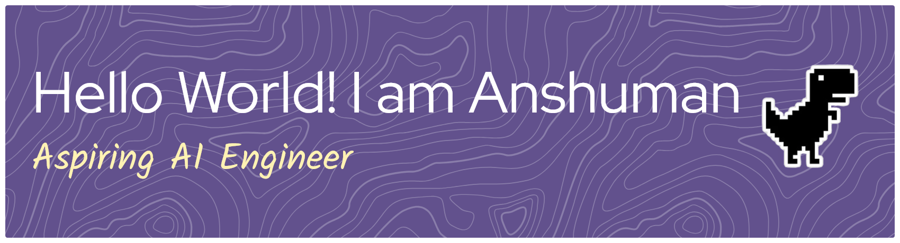
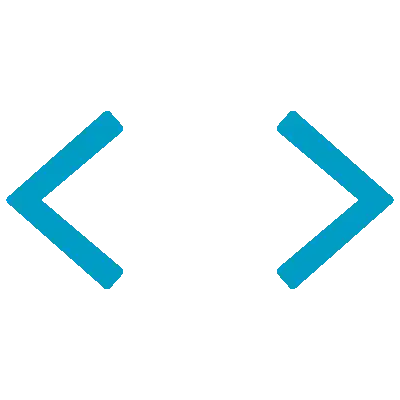

<!--

Thank you if you like this profile README!

BUT, please DO NOT copy this and create your profile based on it.

You can use it as a reference, and copy a part of it, but DO NOT copy
all of this and create your profile based on it.

It is very common that you forget to change some information and leave
mine in your profile. This has happened too many times.

And, this profile README is auto-updated by GitHub Actions, you can read
[the official documentation](https://docs.github.com/actions) to learn
how to use it.

Only when you know what you are copying should you paste it. So, again,
please DO NOT copy this and create your profile based on it.

What's more, you can find other awesome profile READMEs at
https://github.com/abhisheknaiidu/awesome-github-profile-readme. There
could be a profile README that fits you better than this one.

Wish you a good-looking profile README!

                                   —— Su (https://github.com/DataBoySu)

-->
<p align="center"><a href="https://soundcloud.com/soulchefmusic/write-this-down-instrumental?in=imtorm/sets/aight&utm_source=clipboard&utm_medium=text&utm_campaign=social_sharing"></a></p>
<p align="center"></p>
<p align="left">  </p><p align="center"></p>

---

<table width="100%">  <tr>    <td align="left" style="border:none;padding:0;margin:0;vertical-align:top;width:40%;">
      
    </td>    <td align="right" style="border:none;padding:0;">      
    </td>  </tr></table><br>

---

# 

<details>
  <summary>
    
  </summary>
  <p align="center">
    
  </p></details><details>  <summary>
    
  </summary>  <p align="center">
    
  </p></details>

[](https://raw.githubusercontent.com/DataBoySu/Resume/main/su_resume.pdf)

<p align="center">  <a href="https://linkedin.com/in/anshumansingh2023"></a>
  <a href="https://bsky.app/profile/oneinrandomforest.bsky.social"></a>
  <a href="https://x.com/Void_The_Null"></a>
  <a href="https://kaggle.com/anshumansingh001"></a>
  <a href="https://www.hackerrank.com/anshumanr434"></a></p><br>

[](Su_Stars.md)


---

## 
<table width="100%" border="0" cellpadding="0" cellspacing="0" style="border:none;">
  <tr>    <td align="left">      
    </td>    <td align="right" width="50%">
      
    </td>  </tr></table>

<!-- my-badges start -->

<!-- my-badges end -->

---

<details>
<summary>

## 

</summary>

<!--START_SECTION:waka-->


**I'm a Night 🦉** 

```text
🌞 Morning                48 commits          ⣿⣿⣿⣿⣀⣀⣀⣀⣀⣀⣀⣀⣀⣀⣀⣀⣀⣀⣀⣀⣀⣀⣀⣀⣀   17.71 % 
🌆 Daytime                77 commits          ⣿⣿⣿⣿⣿⣿⣿⣀⣀⣀⣀⣀⣀⣀⣀⣀⣀⣀⣀⣀⣀⣀⣀⣀⣀   28.41 % 
🌃 Evening                127 commits         ⣿⣿⣿⣿⣿⣿⣿⣿⣿⣿⣿⣿⣀⣀⣀⣀⣀⣀⣀⣀⣀⣀⣀⣀⣀   46.86 % 
🌙 Night                  19 commits          ⣿⣿⣀⣀⣀⣀⣀⣀⣀⣀⣀⣀⣀⣀⣀⣀⣀⣀⣀⣀⣀⣀⣀⣀⣀   07.01 % 
```


📊 **This Week I Spent My Time On** 

```text
💬 Programming Languages: 
Markdown                 5 hrs 25 mins       ⣿⣿⣿⣿⣿⣿⣿⣿⣿⣿⣿⣿⣿⣿⣿⣿⣿⣿⣿⣿⣀⣀⣀⣀⣀   80.93 % 
YAML                     1 hr 16 mins        ⣿⣿⣿⣿⣿⣀⣀⣀⣀⣀⣀⣀⣀⣀⣀⣀⣀⣀⣀⣀⣀⣀⣀⣀⣀   19.00 % 
Git                      0 secs              ⣀⣀⣀⣀⣀⣀⣀⣀⣀⣀⣀⣀⣀⣀⣀⣀⣀⣀⣀⣀⣀⣀⣀⣀⣀   00.04 % 
Other                    0 secs              ⣀⣀⣀⣀⣀⣀⣀⣀⣀⣀⣀⣀⣀⣀⣀⣀⣀⣀⣀⣀⣀⣀⣀⣀⣀   00.03 % 
```


 Last Updated on 21/12/2025 23:38:15 UTC
<!--END_SECTION:waka-->
</details><br>

---
<!-- Tech Stack -->
<details>  <summary>    <p align="center">      
          </p>  </summary>
<h3 align="center">Programming</h3>
<div align="center">
<table style="background-color: black; color: white; border: none; border-radius: 15px; overflow: hidden;">
  <thead>
    <tr>
      <th colspan="4" align="center" style="color: white;">Languages</th>
    </tr>
  </thead>
  <tbody>
    <tr>
        <td align="center" style="border: none;">
            <br>Python      </td>    </tr>  </tbody></table></div><h3 align="center">AI/ML & Data Science</h3>
<div align="center">
  <table style="background-color: black; color: white; border: none; border-radius: 15px; overflow: hidden;">
  <thead>
    <tr>
      <th align="center" colspan="4"style="color: white;">Libraries & Frameworks</th>
    </tr>  </thead>  <tbody>    <tr>      <td align="center" style="border: none;">
        <br>NumPy
      </td>
      <td align="center" style="border: none;">
        <br>Pandas
      </td>
      <td align="center" style="border: none;">
        <br>Keras
      </td>
      <td align="center" style="border: none;">
        <br>PyTorch
      </td>    </tr>    <tr>
      <td align="center" style="border: none;">
        <br>SkLearn      </td>      <td align="center" style="border: none;">
        <br>CatBoost      </td>      <td align="center" style="border: none;">
        <br>HF      </td>      <td align="center" style="border: none;">
        <br>Cupy
      </td>    </tr>  </tbody> </table></div><h3 align="center">Web Development</h3><div align="center">
<table style="background-color: black; color: white; border: none; border-radius: 15px; overflow: hidden;">
  <thead>    <tr>
      <th colspan="8" align="center" style="color: white;">Frontend</th>
    </tr>  </thead>  <tbody>    <tr>      <td align="center" style="border: none;">
        <a href="https://nextjs.org/" style="color: white;">
          
        </a>
        <br>Streamlit      </td>      <td align="center" style="border: none;">
        <a href="https://developer.mozilla.org/en-US/docs/Web/HTML" style="color: white;">
          
        </a>        <br>HTML      </td>      <td align="center" style="border: none;">
        <a href="https://developer.mozilla.org/en-US/docs/Web/CSS" style="color: white;">
          
        </a>        <br>CSS      </td>    </tr>  </tbody></table></div><div align="center">
<table style="background-color: black; color: white; border: none; border-radius: 15px; overflow: hidden;">
  <thead>    <tr>      <th colspan="4" align="center" style="color: white;">Backend</th>
    </tr>  </thead>  <tbody>    <tr>      <td align="center" style="border: none;">
        <br>Flask
      </td>      <td align="center" style="border: none;">
        <br>FastAPI
      </td>    </tr>  </tbody></table></div>
<div align="center">
<table style="background-color: black; color: white; border: none; border-radius: 15px; overflow: hidden;">
  <thead>    <tr>      <th colspan="4" align="center" style="color: white;">Database</th>
    </tr>  </thead>  <tbody>    <tr>
      <td align="center" style="border: none;">
        <br>MySQL
      </td>    </tr>  </tbody></table></div><h3 align="center">MLOps & DevOps</h3><div align="center">
<table style="background-color: black; color: white; border: none; border-radius: 15px; overflow: hidden;">
  <thead>    <tr>      <th colspan="4" align="center" style="color: white;">Containerization</th>    </tr>  </thead>  <tbody>    <tr>
      <td align="center" style="border: none;">
        <br>Docker
      </td>    </tr>  </tbody></table></div><div align="center">
<table style="background-color: black; color: white; border: none; border-radius: 15px; overflow: hidden;">
  <thead>    <tr>      <th colspan="3" align="center" style="color: white;">Frameworks & Tools</th>    </tr>  </thead>    <tr>      <td align="center" style="border: none;">
        <br>LM Studio      </td>    </tr>  </tbody></table></div></details>
<p align="center">  

  [](https://soundcloud.com/soulchefmusic/write-this-down-instrumental?in=imtorm/sets/aight&utm_source=clipboard&utm_medium=text&utm_campaign=social_sharing)

</p>
